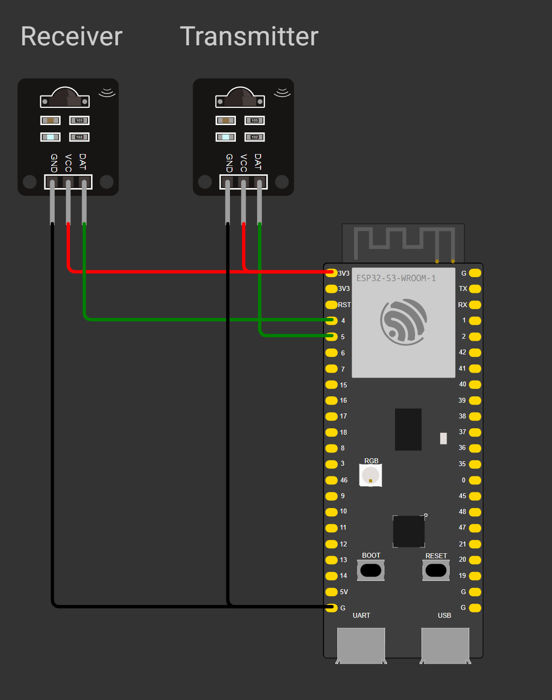
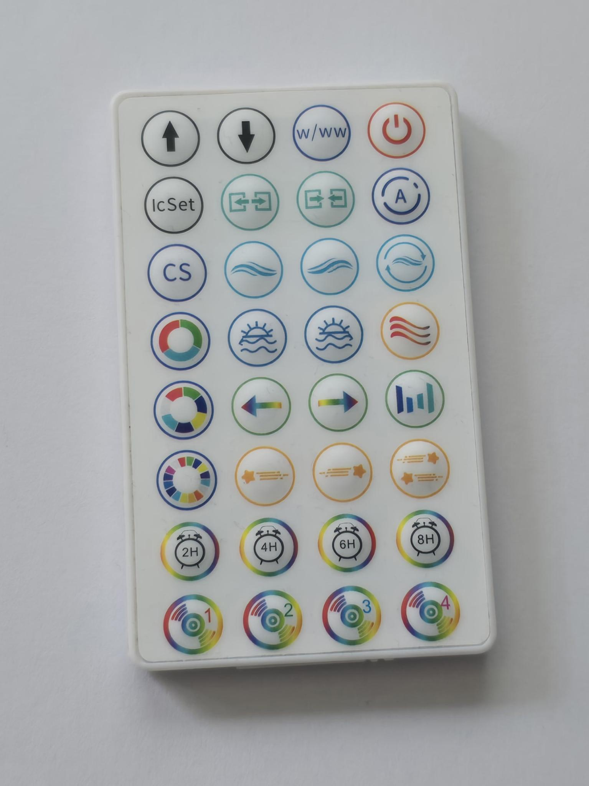

# esp32s3-IR-Remote
ESP32s3 arduino project for sending and receiving IR signals.
# Requirements
- You need to install esp32 (Espressif Systems) from the board manager (Tested with 3.3.7)
- You need to use the ESP32S3 Dev Module as the board, any port
- You need the IRremoteESP8266 library (Tested with 2.9.0)

| Visualisation        |32 Button IR Remote that works|
|----------------------|:----------------------------:|
|  |          |

    
